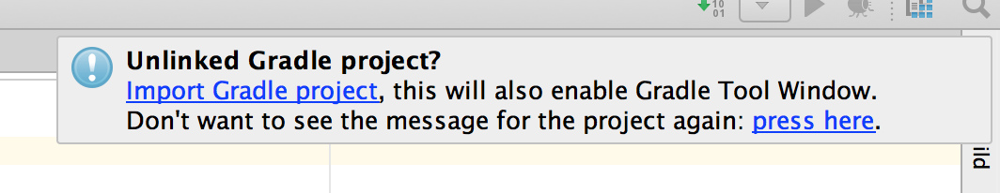
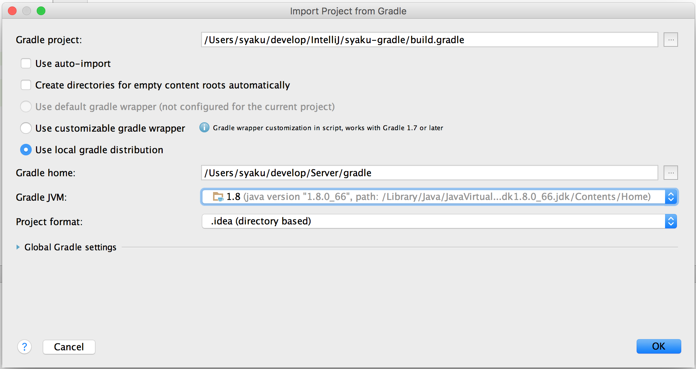
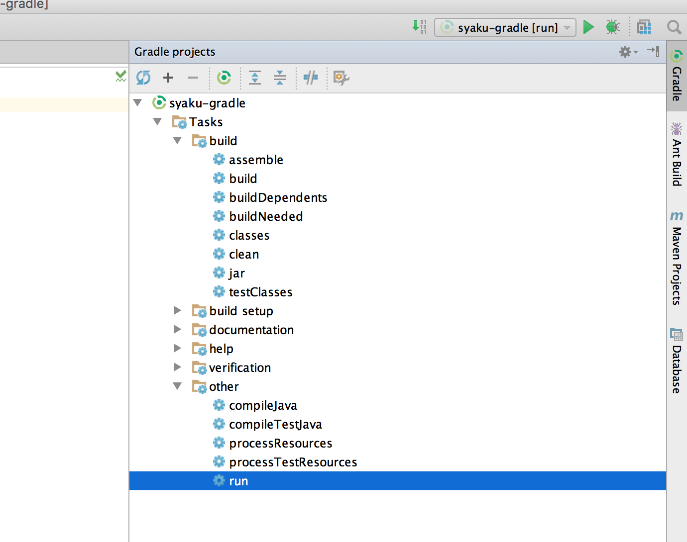

# Gradle Java Project & IntelliJ
--

### 개발환경
> IntelliJ 14.x  
Gradle 2.12  
Java 8  

인텔리J IDE를 이용한 Gradle 자바 프로젝트를 만들어 보자. 나는 메이븐과 Ant를 조합하여 사용해왔다. 그렇다고 메이븐을 잘 다루는 것은 아니다. 그래서 이번기회에 Gradle을 사용하여 좀 더 크리티컬한 작업을 수행해 볼 것이다.

Gradle은 빌드 툴이다. 단순한 빌드가 아닌 시나리오를 구현하여 내가 원하는 방식데로 빌드를 수행해준다.

우선 Gradle을 설치하고 인텔리J를 이용하여 자바의 시작 Hello, World! Gradle로 빌드하여 출력해보자.

### Gradle Installing

Gradle site : http://gradle.org

Grable 사이트에 보면 간략한 사용 메뉴얼을 볼 수 있다. http://gradle.org/getting-started-gradle-java 시작하기전에 참고하면 좋을 것 같다.

이제 Gradle 사용자 가이드를 열어 Gradle을 설치하고 구동해보자. https://docs.gradle.org/current/userguide/userguide.html

II-3 이 설치방법을 설명하고 있다. Gradle은 자바 6 과 그 이상에 버전에 대응되고 있다라는 구문을 확인할 수 있고 그루비를 설치할 필요가 없다고 한다. 다들 알겠지만 Gradle은 그루비로 만들어진 프로젝트다. 그리고 운영체제 환경변수에서 JAVA_HOME 변수에는 자바 홈 디렉토리를 가르키도록 해야한다. 

```
$ cd ~
$ vi .bash_profile

export GRADLE_HOME=~/develop/Server/gradle
export PATH=${PATH}:~/develop/Server/gradle/bin

$ source .bash_profile
```

그외 환경변수 설정은 구글링하면 찾을 수 있으니 생략한다.

Gradle 다운로드에서 바이너리로 된 파일을 다운받고 압축을 푼다. 환경변수에 GRADLE_HOME 추가하고 Gradle 디렉토리를 설정한다.
그리고 PATH 환경변수에 Gradle 하위 폴더인 ./bin 폴더까지 경로를 추가해준다.

이제 설치가되었는 지 구동해보자.

```
$ gradle -v

------------------------------------------------------------
Gradle 2.12
------------------------------------------------------------

Build time:   2016-03-14 08:32:03 UTC
Build number: none
Revision:     b29fbb64ad6b068cb3f05f7e40dc670472129bc0

Groovy:       2.4.4
Ant:          Apache Ant(TM) version 1.9.3 compiled on December 23 2013
JVM:          1.8.0_66 (Oracle Corporation 25.66-b17)
OS:           Mac OS X 10.11.4 x86_64
```

### IntelliJ Gradle Project

https://docs.gradle.org/current/userguide/tutorial_java_projects.html 가이드를 참고하면 도움된다.

인텔리J에서 기본적으로 제공되는 Gradle 모듈을 사용하지 않고 오리지널 자바 프로젝트를 생성한 후 Gradle을 추가할 것이다. 그래서 아래와 같이 프로젝트를 생성한다.

Gradle의 기본 프로젝트 레이아웃은 아래의 구조와 같다. 원한다면 레이아웃 구조를 변경할 수 있다.

```
src/
	main/
		java
		resources
	test/
		java
		resources
build/
	classes/
```

Hello World!! 를 출력하기 위해 클래스 파일을 생성한다.

```java
package org.syaku;

/**
 * @author Seok Kyun. Choi. 최석균 (Syaku)
 * @site http://syaku.tistory.com
 * @since 16. 3. 31.
 */
public class HelloWorld {

	public static void main(String[] args) {
		System.out.println("Hello, World!!");
	}
}
```

이제 Gradle 빌드 파일을 생성한다. 최상위 경로 `build.gradle` 파일을 생성한다.

**build.gradle**

```
// java 플러그인을 추가한다.
apply plugin: 'java'
```

터미널에서 빌드를 실행해보자.

```
$ gradle build

:compileJava
:processResources UP-TO-DATE
:classes
:jar
:assemble
:compileTestJava UP-TO-DATE
:processTestResources UP-TO-DATE
:testClasses UP-TO-DATE
:test UP-TO-DATE
:check UP-TO-DATE
:build

BUILD SUCCESSFUL

Total time: 2.648 secs

This build could be faster, please consider using the Gradle Daemon: https://docs.gradle.org/2.12/userguide/gradle_daemon.html
```

위와같이 빌드가 완료되면 build 폴더에 빌드된 결과 파일들이 쌓이게 된다. `classes/main` 하위에 클래스파일이 생성되는 것이 맘에 들지 않는 다. 그렇다면 아래와 같이 경로를 변경해주면 된다.

[참고] https://docs.gradle.org/current/userguide/java_plugin.html

**build.gradle**

```
// java 플러그인을 추가한다.
apply plugin: 'java'

sourceSets {
    main {
        output.classesDir "$buildDir/classes"
    }
}
```

빌드된 정보를 제거하고 다시 빌드한다.

```
$ gradle clean
$ gradle build
```

이제 `build/classes` 경로 아래 클래스 파일이 생성된 것을 확인할 수 있다.

Hello, World! 출력하기 위해 아래 task 를 Gradle 빌드에 추가한다.

```
task(run, dependsOn: 'classes', type: JavaExec) {
    main = 'org.syaku.HelloWorld'
    classpath = sourceSets.main.runtimeClasspath
}
```

빌드를 실행한다.

```
$ gradle run

:compileJava
:processResources UP-TO-DATE
:classes
:run
Hello, World!

BUILD SUCCESSFUL

Total time: 2.764 secs
```

마지막으로 인텔리J에 Gradle을 연동시키겠다. Gradle 빌드 파일을 열어 idea 플러그인을 추가한다.

**build.gradle**

```
apply plugin: 'idea'
```

터미널에서 빌드를 실행한다.

```
$ gradle idea
```

그럼 인텔리J에 Gradle 설정파일들이 생성된다. 인텔리J 재시작 후 아래와 같이 설정하면 된다.



Import Gradle project 문구를 클릭한다.



Gradle 홈을 설정해주고 확인을 누른다.



인텔리J 오른쪽 영역에 Gradle 프로젝트가 추가된 것을 확인할 수 있다.

다음 포스팅은 스프링 프레임워크를 이용하여 Gradle 프로젝트를 만들어 볼 것이다.


